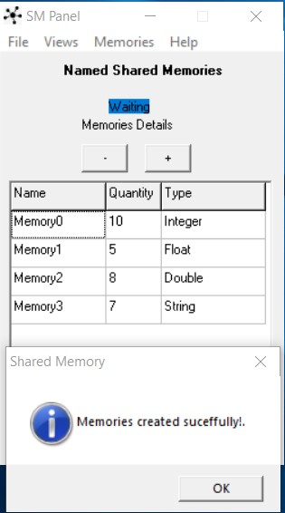

# SharedMemoryClient
**SMClient** is a project that offers dynamic link libraries (*.dll) with functions for creating, reading, writing and releasing virtual memories. 
**Shared Memories is a type of Interprocess Communication (IPC)** that allows two or several programs to access a memory location making it possible to transfer data between processes and/or between applications.

# Content
The project is divided into two parts:
Executable files that are ready to be used.
- Admin Panel
- Libraries
- Help & Examples

Source codes that can be studied and modified.
- Src
	- SMPanel
	- SMClient

# Quick Start
To perform a quick test of Shared Memory Client we need:
- The shared memory creation and management panel **(Admin Panel)**
- The dynamic link library **(Libraries)**
- Sample codes in the language or application we want **(Help & Examples)**

# Usage
We will review an example where Matlab stores two values (Integer and Floating) in the Shared Memory, and then reading those values from a C# project.

#### Administration Panel 
Once we have downloaded the necessary folders and files, the first task is to run the panel for creating shared memories "Admin Panel\smProject.exe". In this administration panel, we can perform the following actions:
- Specify the shared memories that we want to create, for which we need to establish: Name of the shared memory (Name), number of values to be stored (Quantity) and the type of value to be stored (Type).
- Create and release the specified shared memories.
- View the data that is stored in the shared memories.
- Save and load our memories configurations.

For quick use of the examples, you must load the sample memory scheme "File-> Open" the name of the file is "exampleCreation.sav" and then initialize the memories in "Memories-> create memories."



**NOTE:** If we want to visualize the data found in the shared memories, we can open the viewer in "Views-> Visualize"

#### Client library
The next step is to choose which programming language or application we want to test reading and writing in shared memories, the available examples are:

**NOTE: All examples are fully documented, here is only a small explanation so that the reader can appreciate how the use is.**
- C# (Visual Studio Standard and Unity3D)
- C/C++
- Excel
- Java
- Matlab
- Python
- Visual basic

**NOTE: In all the examples the steps to follow are the same:**
1. First we need to **Load de Dynamic Link Library** (For 32Bits or 64Bits) depending on your application. The library (*..dll file) must be stored in the same place as the executable or it can be in the System32 folder.
2. Then we must **open the shared memory** by calling the openMemory function, specifying the name of the memory and the type of memory (Integer = 1; Floating = 2; Double = 3; Char[64] = 4), we must open all the memories needed to work.
3. Once the memory(s) are open **we can read and/or write** to it using the function corresponding to each type of variable (Integer, float, double, char *).  

A more detailed explanation about the functions can be found in the source code file or [in the Wiki - Clic here](https://github.com/EliGor1989/sharedMemoryClient/wiki/Functions-in-the-Library).

#### Matlab Example
Example of using the dynamic link library in Matlab.
1. Load the Dynamic Link Library. 

If we want to use a 64-bit Matlab we load "smClient64.dll", the library must be in the path that is exploring Matlab, or it must be in a Windows installation folder or in a folder added to the operating system PATH, then the file "smClient.h" must must be in the path that is exploring Matlab. 

In our example the library and the header will be in the current Matlab path, but if you want, you can use the absolute path to the location of your files.

For more information you can check the Matlab.m sample file.

**NOTE:** If you have any problems running this example like **"No supported compiler was found"**, you can check the [help on the Wiki page - Clic here](https://github.com/EliGor1989/sharedMemoryClient/wiki/Trouble-help#2-error-error-using-loadlibrary-no-supported-compiler-was-found-you-can-install-the-freely-available-mingw-w64).

```matlab
loadlibrary('smClient64.dll','smClient.h')
```
2. Then we need to open the memory or the shared memories we want to work with.
Open an Integer memory (1 means Integer Memory), If the shared memory is opened correctly, the value zero (0) is returned.
```matlab
calllib('smClient64','openMemory','Memory0',1)
``` 
Open a Float memory (2 means Float Memory)
```matlab
calllib('smClient64','openMemory','Memory1',2) 
```
3. We can read and/or write in memory.

Write in the memory "Memory0" in position 2 the value 30

We can verify that the value was written correctly by displaying in the Shared Memories Administration Panel.
```matlab
calllib('smClient64','setInt','Memory0',2,30)
``` 
Write in the memory "Memory1" in position 1 the value 30.1204
```matlab
calllib('smClient64','setFloat','Memory1',1,30.1204)
``` 

#### C# Example
We compile and execute the C# sample project that was carried out in Visual Studio 2017, or we can just run the compiler file smExample.exe allocated in \Help & Examples\C#\smExample\bin\x64\Debug.

We can use the example codes perfectly in both a project created in Visual Studio in C# language and if we create a project in Unity3D that uses code in C#.

1. In the example interface we must specify the Name of the shared memories to Open, then click Open in each memory.

Explanation: Load de Dynamic Link Library. If we are in a 64-bit C# application we load "smClient64.dll", the library must be in the same place where we hace the .exe output or in the System32 folder.

The [DllImport (dllPath)] statement must be for each function call statement of the library. For example for open a Shared Memory, we use the function in the library, but c# need to know how to access to this function, for this reason we declare the function structure:
```csharp
const string dllPath = "smClient64.dll"; //Dll Path

[DllImport(dllPath)]
static extern int openMemory(String name, int type);
```
If we want, we can check how C# open a Shared Memory, checking the code from the Open Button. In the parameters 1 means Integer Memory.

```csharp
int retOpen = openMemory("Memory0", 1);
``` 
Open a Float memory (2 means Float Memory)
```csharp
int retOpen = openMemory("Memory1", 2);
```
2. Now we can Write/Read in the shared memories. C# can use the functions to get the Integer and Float values because we have declare how to work with the dll.
```csharp
[DllImport(dllPath)]
static extern int getInt(String memName, int position);

[DllImport(dllPath)]
static extern float getFloat(String memName, int position);
```
If we want to write, just set the position where we want to save a value and then in Value set the value, then clic in Write. To read a value you just have to write the position from which memory we want to read and clic en Read.

The codes used for get the values which were saved from Matlab are these.

Read in the Integer memory "Memory0" in position 2.
```csharp
int value = getInt("Memory0", 2);
``` 
Read in the Float memory "Memory1" in position 1.
```csharp
float Value = getFloat("Memory1", 1);
```

#### Result
Following the steps correctly, Matlab stores numbers in an Integer type memory and also floating numbers in a floating type memory. In the same way, these values are read in Unity3D/C#. 

Note: For more information on the available functions, you can read the Wiki page or in the example codes, where the respective explanations to each code fragment are commented.

# Wiki 
All the necessary information is documented in the source codes of the examples, but if you want to review some more documentation about the project, [you can check the Wiki page here](https://github.com/EliGor1989/sharedMemoryClient/wiki)
